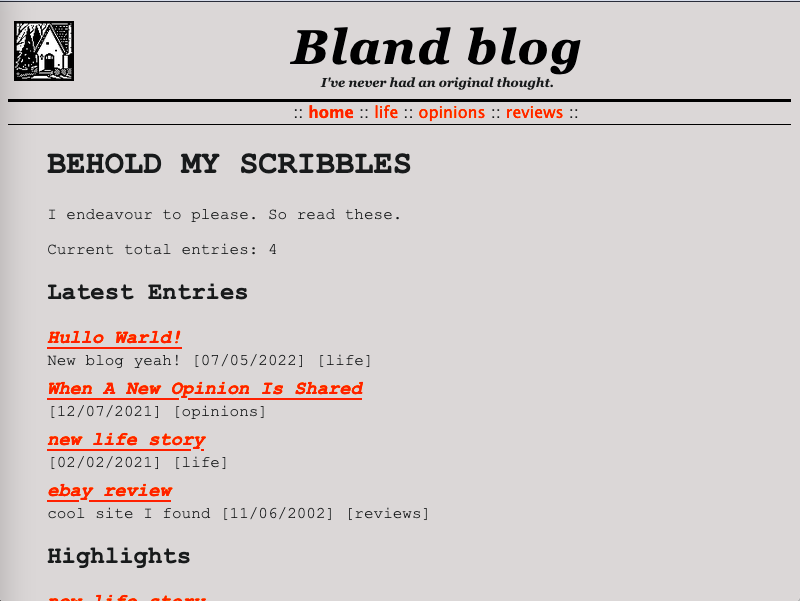

Thransoft RSRU Release 3.2
==========================
Skip to user's guide: [RSRU HOWTO](docs/HOWTO.md).

# What is RSRU?
A simple static HTML page generator written in Perl. It is intended for the sole task of generating a section of my website [Well Made Web](https://wmw.thran.uk), but RSRU is flexible enough that it could build other websites. GPLv3 licence.

RSRU is ideal for building any kind of catalogue website. It can also build news/blog websites. You could use it to build:

- a download website
- a screenshot showcase of your favourite desktops
- a photo gallery
- a listing of your favourite albums by genre with copious notes glorifying your pristine music taste
- a list of your favourite books or places to visit
- a news section for your website
- a simple blog
- or just copy me and build an index of weird and wonderful websites you've discovered

**Anything** is possible when you tweak the template files and the keywords. Then RSRU can do all the hard work of building the website for you.

RSRU comes with four template types: Software Catalogue, Link Catalogue, News Website and Bland Blog. Included are the configuration files that will build each of these websites, as well as sample entry files to demonstrate how to fill each site type with your writing.

RSRU works only in HTML and CSS. There are fewer than 300 lines of CSS. It is happy with or without some optional Perl modules. That's living the simple life.

# What does RSRU mean?
*R*eally *S*mall, *R*eally *U*seful. It pithily describes my hopes for this script.

# How does RSRU work?
RSRU will read each text file in the `entries/` directory. It will determine the title, description, category and other fields for each entry. These will be made into rows which are appended to web pages. It also generates a nice homepage for your website.

Each entry will belong to a category. Each category will appear as tab-style HTML pages. So for each, you get a category page with all the entries listed below.

RSRU will also generate image thumbnails and RSS feeds for you.

# How do I RSRU?
If you're eager to try RSRU, instructions are available here: [RSRU HOWTO](docs/HOWTO.md). The comprehensive documentation covers installation, configuration, customisation and everyday operation. Any other questions you have may be raised as a ticket on this repository.

If you want to start quickly, just download the latest release. Edit a text file under `entries/` (don't delete anything ending with a colon, but change anything to the right of the colon). Then run `./rsru.pl` and open `./output/index.html` in a web browser. This will give you a practical demonstration of what it does.

# Requirements
* Perl, at least version 5.16.
* Anything that runs Perl. The author has tested on Linux and Windows (Strawberry Perl). 

## CPAN Modules
RSRU's core functionality operates using only standard library modules. The project goals will not require any hard dependencies on any CPAN modules. Future non-essential features (eg, RSS) may depend upon CPAN modules, but RSRU will still perform its core duties without them.

- Time::Piece is mandatory. It is 'core' everywhere except Fedora/Red Hat, for some strange reason.
- XML::RSS is optional. It is (surprisingly) used by RSRU to generate an RSS feed.
- GD is optional. It is used to generate image thumbnails and convert PNG to JPEG, if desired.

# Future hackery for RSRU, known issues
* Make pathnames deterministic. Currently we just sort alphabetically then chronologically, then make a new page when the previous page is filled. This means that entries aren't guaranteed to be on the same page, but will move further back down the list and onto higher numbered pages. This will be a problem for hyperlink consistency.
* Very far in the future: Use a real templating engine (like Template::Tookit) to build our pages. This would make RSRU into something approaching a full site generator. I think this would be best suited for a new project, but it would be easy for such a rewrite to read the same entry file format used by RSRU.

# Repository layout
What are the directories and what is inside each?

`conf_samples` : A variety of config files intended to build sample websites in RSRU. Each config file matches a template style under `tpl`. To try a config sample, run `./rsru.pl -c ./conf_samples/<CONF_NAME>.pl`. To make a config sample permanent, copy it to the root and rename it conf.pl (replacing the default). You'll then no longer have to run RSRU with any `-c` option flag.

`docs` : Documentation including release history and HOWTO.

`entries` : Default sample entries for the softcat template. Also the default source directory whence RSRU will read its entries.

`entries_samples` : Sample entries to demonstrate the other config samples. Once you understand how the entries are written, you may safely remove this directory.

`img` : Sample image files to demonstrate RSRU's thumbnail generation. Also the default source directory RSRU will check for your images.

`misc` : Screenshots and images intended to show how RSRU looks. This directory may be safely deleted once you've settled for a style.

`output` : The default destination directory whereto RSRU writes its generated website. Not tracked in Git by default (see `.gitignore`).

`tpl` : The template root directory. All style template files are stored in subdirectories under here.

## Release history & dev homepage
[Devlog](./docs/DEVLOG.md)

[Thransoft](https://soft.thran.uk)

## Sample Screenshots

