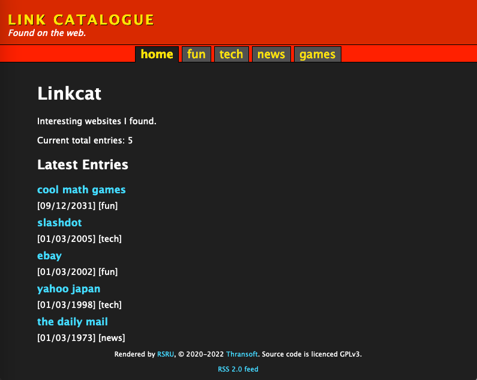

_RSRU_ HOWTO
============

User's Guide covering installation, configuration, customisation and utilisation. Valid for Release 3.

# RSRU in brief

RSRU, or _Really Small, Really Useful_, is a static website builder written in Perl.
It currently specialises in building "catalogue" style websites, so it is ideal for building a website dedicated to collections.

Sample templates are included for building a link catalogue or a software catalogue. These may be adapted to fit your needs.

PRACTICAL AND CONVENIENT TO THOSE ALREADY FAMILIAR WITH THE UNIX TERMINAL

# Installation

## System Requirements

- Windows, Linux or Mac OSX. RSRU has been tested on Windows and Linux but should also work on OSX.
- Perl v5.18 or later (exact version hasn't been tested, but RSRU is very vanilla Perl so probably works on older versions too).

## Readying Perl

If you are on Windows, first [install Strawberry Perl](https://strawberryperl.com/). If you are using Linux or OSX, your operating system has good taste and already includes Perl.

If you have never used Perl before, run `cpan` from a command window and agree to all the defaults. This will allow installation of helper modules for RSRU.

## Installing Helper Modules (Optional)

You may wish to include pictures in your website. You may also wish to generate RSS feeds so your eager audience can stay informed of your latest discoveries.
In these cases, RSRU needs some help to perform these duties. *If you opt against installing these, RSRU is still usable but will be without RSS and graphics processing.*

**NOTE:** To install the graphics module on Linux, another library must first be installed. This is not necessary on Windows.

Open a command window and run the following as root/sudo on Debian:

```
# apt install build-essential libgd-dev
```

Or on Void Linux:

```
# xbps-install base-devel gd-devel
```

I haven't used other Linux versions, but if you find how to install the GD dev library for that distro it should work. You can also install the Perl modules directly using your distro's packager, if you prefer and have the knowhow.

### Installing the CPAN modules

CPAN is the pakager for Perl. It will fetch and install our helper modules. To install these, open a command line on your Windows or \*nix box and run:

```
$ cpan install XML::RSS GD
```

You'll also need `Time::Piece` if you're using anything in the Fedora/RH/CentOS family.

## Download and extract RSRU

Download the latest version of RSRU from [Thransoft](https://soft.thran.uk) or [GitHub](https://github.com/lordfeck/rsru/releases). Extract the tar or zipfile to a convenient location in your filesystem.

```
$ tar -xvzf rsru_r3.tar.gz
```

On Windows you can use the Windows file extraction wizard, 7zip, WinZip, WinRAR, pkzip or whichever unzipper is nearest to hand.

# Configuration

The default config file `./conf.pl` defaults to the *softcat* style. Other styles are available, currently only *linkcat*. See the sample config files in the `conf_samples/` directory for to try each of these styles. A full explanation is given later.

## Edit conf.pl
Before the script may be used, it is first necessary to tailor `conf.pl` to your liking. The config file is just a plain Perl hash, which means you can include any other Perl code you fancy. It also means that when editing the values, please be careful to edit only between the "quote marks" and leave all the values to the left of the fat arrows `=>` alone.

Most config options are structured as follows:

`optionName => "optionValue",`

Just edit "optionValue" to be whatever you wish. There are adequate comments explaning the options, but further explanation follows:

`liveURL` specifies the base URL for production mode. This is the web address for where you intend to publish the site built by RSRU.

`tplinc` should point to the source directory containing the template files. This value points to the template directory matching each sample config file. Change this to change the style RSRU uses to generate your website.

`out` is the directory where RSRU will write the website it has built. This defaults to `./output`. You may view these output files in a web browser after they are built.

`entrydir` where to read the entry files from. Default: `entries/`.

`clearDest` set to 1 if you want RSRU to wipe the output directory before writing the generated website. Set it to 0 if you want the old files left alone. Manually override this by running RSRU with the `-r` command line flag, which will set RSRU to wipe the output folder.

## Presentation config
Edit the following fields in conf.pl to set some descriptive text fields on the site. `siteName` is a particularly important one!

`siteName`, `siteHeaderDesc`. Site Name is used in the HTML "TITLE" element and the masthead of each page. HeaderDesc is a brief description printed beneath.

`siteHomepageHeader`, `siteHomepageDesc` are used to fill in the homepage.

`maxPerPage` the maximum number of entries that will be printed before a new page is made. Used for each category.

`maxHpHighlights` the maximum number of highlighted entries that will be shown on the homepage.

`showCatTotal` set to 1 if you want the total amount of entries displayed at the top of each category page. Set to 0 if you don't want this.

## RSS Config

`rssEnabled` set to 1 if you want an RSS feed generated. Set to 0 if not. When this is set to 0 links and meta tags for RSS are not generated.

`rssFilepath` set a name for the generated RSS feed. Usually the defualt is fine.

`rssEntryMax` set a value for the maximum number of entries that will be included in the RSS feed. 

`rssLang` set the language tag for RSS.

`rssCopyright` set your copyright licence for RSS (eg, your name or creative commons).

## Image config

`imagesEnabled` set to 1 to enable thumbnail generation and image copying/linking for each entry that has images. Set to 0 to disable all images.

`thumbnailSize` set to the resolution you want for the thumbnails in the format `<WIDTH>x<HEIGHT>`. The default of 150x150 is a sane value. Note: You will also need to edit the template CSS file to match this value.

`imgSrcDir` the directory where RSRU will look for its images.

`imgDestDir` where RSRU will write the final images. This directory will be under the root of your website's URL.

`imgToJpeg` if set to 1, all source images will be converted to JPEG. If set to 0, only the thumbnails are rendered as JPEG and the original image will simply be copied to the destDir.

`noClobberImg` a timesaving measure. Images will not be re-converted if they already exist under the destDir. Set to 1 to enable, 0 to disable. Run RSRU with the `-r` command line flag if you want to ignore this setting and overwrite all images.

## Category config

This section uses Perl lists. Please edit only the values inside the `[ EDIT_THESE ],` list, i.e. between the brackets. **The category list and known keys list must be single words, or phrases with underscores. Do not use spaces.** If you mess with the list formatting RSRU and its big brother Perl will not like you.

`cats` a Perl list of the default categories. The categories in your entries should match one of these, but this isn't necessary. Unknown categories will have pages generated regardless. **Do not use spaces for the cat names, but you may use underscores or hyphens in their place.**

`knownKeys` A list of keys that are possible to be in each entry text file. Each of these keys should also exist in the rsru_entry.html and rsru_entry_img.html template files. When building an entry, RSRU will look for each of these keys in each of your entry text files, then fill their values into their placeholders in the template. **NOTE:** *desc* should always be in this list.

`necessaryKeys` A subset of the above list. All these keys will be mandatory for each entry. If RSRU encounters an entry without any of these keys, it will print an error message and exit. 

`catDesc` A Perl array mapping each category name to a description. Formatted as follows: `CAT_NAME => "category description",`. The category description is printed at the top of each category page in your website. To exclude a description for a certain category, just make its string empty. `CAT_NAME` should match the category name in the `cats` list described above.

## Logging levels

By default, RSRU doesn't say much while it is working. If you need to know what it is doing with your precious entries, here is how to make it talk more.

`verbose` If your website isn't being built right set this to `1` to enable verbose logging. It may offer clues to where you have went wrong.

`debug` If "verbose" didn't remedy your malady, set this one to `1`. Things will be very noisy and this may actually make matters less clear.

# Customisation

Now that you've RSRU ready and waiting on your system, it is time to decide which template you prefer.

Currently, two templates are available: linkcat and softcat. 




You can easily try either using the command line switches:

`./rsru.pl -c conf_samples/conf_linkcat.pl`

`./rsru.pl -c conf_samples/conf_softcat.pl`

Pick one of these styles and tweak the keywords, css and HTML layout to your liking. A guide instructing you in this very task follows.

## Templating
The template files are read by default from `./tpl/<TPL_NAME>/`. Each HTML file under here is essential and used to weave the output. There is also a `common` directory which holds HTML template files that are common to all templates *(This is possible because much of the style is just handled with CSS)* but it is trivial to override the common template files.

The template format for RSRU is very straightforward. RSRU maps placeholder fields in the template files to keyword values in your entry text files. To illustrate this practically:

You have an entry called `excellent.txt`. Inside it:

```
title: Excellent entry!
rating: 100/10

They don't come any better.
```

RSRU reads in a template file called `rsru_entry.html`. Inside it there is:

```
<h1></h1>
<div></div>
<div></div>
```

RSRU then takes the entry text file, finds the `` inside the HTML template file and replaces those with the values in the text file. 

You may customise any part of these HTML files. RSRU will then take your superb hypertext craftsmanship and make it into a full fledged website. All it asks is that you leave the special keyword fields intact inside each file. Otherwise things will be weird and broken, like you probably were in school. An explanation of each file and its fields follows.

### Common template directory contents

These are found under `./tpl/common/`.

**rsru_base.html**

The base template file. Each page rendered by rsru.pl will build atop this file.

**Fields in rsru_base.html**

Special fields are in capital letters. They are in the same `` format mentioned above. These are replaced with values sourced from `conf.pl` or other template files.

`FEEDBLOCK_TOP` Where the RSS feed meta link (if enabled) is transplanted. This is the filled contents of `rsru_rss_top.html` are written.

`RSRU_TITLE`, `HEAD_TITLE`: These are replaced with your configured site name in conf.pl. This is the value mapped to `siteName` in the conf file.

`HEAD_DESC`: This is replaced with the value of `siteHeaderDesc` in `conf.pl`. This is the header description displayed under the title on every page.

`RSRU_CATS`: A link to the homepage and links to the first page of each category are rendered here. The links are generated using the template file `rsru_cat.html`. This list appears at the top of every page.

`FEEDBLOCK_BOTTOM` Where the RSS feed link (if enabled) is transplanted. This is the filled contents of `rsru_rss_bottom.html` are written. It is a link to your RSS feed at the bottom of each page.

**SPECIAL NOTE**

Everything between the HTML comments `<!--BEGIN RSRU-->` and `<!--END RSRU-->` is where further rendering happens. RSRU reads in until it hits BEGIN RSRU, then looks for END RSRU. From there it reads to the bottom. This is how we generate a consistent header and footer. 

#### Other common template files

**rsru_index.html**

 Unique text for the homepage, displayed above the latest entries list.

**Fields in rsru_index.html**

`RSRU_HPHD`: Homepage header. Replaced with the contents of `siteHeaderDesc` in conf.pl. Intended to be a friendly greeting for your visitors.

`RSRU_HPDESC`: Homepage description. Replaced with the contents of `siteHomepageDesc`  in conf.pl. A good place to describe the contents and purpose of your website.

**rsru_cat.html**

Used to generate a link to each of your categories at the top of every page.

**Fields in rsru_cat.html**

`IS_ACTIVE`: Replaced with the text `active` to apply the CSS class for an active link. This is applied to the pages of the currently active category. It provides a navigation aid in the link bar.

`CAT_URL`: The link to the first page of this category.

`CAT_NAME`: Replaced with the name of this category. The name of each category is sourced from the `cats` list in conf.pl is sourced from the `cats` list in conf.pl.

**pagination_nav.html**

Template for the pagination at the bottom of each category page. Links to next/previous pages. RSRU will create a new page for each category once the value of `maxPerPage` is exceeded. This template is used to find your way back and forwards through each category.

**Fields in pagination_nav.html**

`IDX_PREV`, `IDX_NEXT`: Links to the previous and next pages in this category.

`IDX` Replaced with the current page number. Used to show to your visitors how far deep they are.

`MAX_URL` A link to the final page in each category. Used to jump to the end.

`MAX` The total number of pages in this category.

**rsru_hp_entry.html**

Template for individual entries linked from the homepage. Used to build lists of the latest entries and highlighted entries in your site.

**Fields in rsru_hp_entry.html**


`rsru_rss_top.html`: Made into an RSS link in the meta section of your pages.

`rsru_rss_bottom.html`: Made into an RSS link at the bottom of each page.

todo:
the "static" dir

How to adapt something in "common". (priority order)

Template files in each template root.

# Utilisation

## Add an entry to RSRU
Add a new file under `./entries/`. It should have the extension `.txt`.

Fill in the text file like the example that follows. Each of the 'fields' have their key terminated by a colon. then the field's value is the rest of the line. Eg, `title: New Entry Making An Entrance` will produce the key `title` and the value `New Entry Making An Entrance`. These fields are split then used to fill in the appropriate parts of the blank template files.

The rest of the file is read until the end and any text there serves as a description. It can be anything in HTML.

### An example entry - softcat

This uses the "softcat" template.

```
title: Sample Soft
version: 1
category: utility
interface: console
img_desc: screenshot of sample soft
os_support: Linux
order: 3
date: 2020-01-01
dl_url: http://www.themostamazingwebsiteontheinternet.com/
is_highlight: no
summary: Something short but interesting said here.
# Lines beginning '#' are skipped, i.e comments
# The rest of the file is the description in HTML
Sample soft offers no convenience to the user. It only exists to provide a sample for RSRU.
This is a new line.
This is <b>bold</b> to test HTML.
```

**NOTE:** The minimum required fields are: _title, version, category, date, desc_. These are coded as `necessaryKeys` in `conf.pl`. It is possible to change this list, should you see fit.

TODO: describe all supported fields.

### An example entry - linkcat

### Running RSRU

Once you have added all your entries, run `./rsru.pl` and it will get busy weaving your pages. By default, these will be written to `./output/`.

**NICE:** The homepage will link to your 5 most recent entries, if at least 5 have been added.

Any entries with the value 'yes' for `is_highlight:` will be added to the 'Highlights' section on the homepage.

## Command Line Flags (optional)
- `-p` for *P*roduction mode. Call `./rsru.pl -p`. The configured live URL will be used as the base URL for all internal links. Without this flag, relative links are instead used.
- `-c <conf>` to load in the specified *C*onfig file. Call `./rsru.pl -c <conf_file>.pl`. The specified configuration file is used to configure your site.
- `-r` for *R*ebuild. Will ignore no-clobber img option and will wipe outout dir.
- `-h` for *H*elp. Prints command line options then exits.
- `-v` for *V*ersion. Prints release information then exists.
- *None*. It is possible to call `./rsru.pl` with no command line flags. It will read in `./conf.pl` and build its configured website.

## Publishing
RSRU has no self-publishing features. While such is possible with the right CPAN modules, such is beyond the scope of this project. 

The author suggests use of [rsync](http://rsync.samba.org) to drop the files on your server. Or script scp, sftp, ftp to do it for you. Alternatively, you could upload RSRU to your web server and set the output directory to somewhere under the www-root.


## TODO:
edit entries, images howto, describe all keys for entries

run it

command line flags

how to publish it

sample entries & conf files for all tpls...
